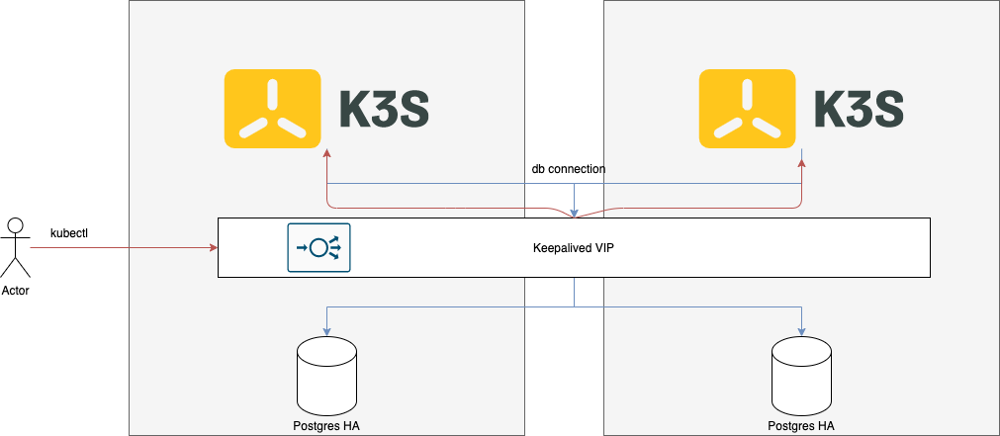

# k3s-ha

Simple shell script to setup a simple 2 node k3s HA cluster

The script will setup the following:
* Bitnami PostgreSQL HA containers for perisistence
* Keepalived for k3s apiserver and postgres endpoint
* K3s server using the said vip and postgres db

The script needs to following arguments

`k3s-ha.sh PRIMARY_IP SECONDARY_IP VIRTUAL_IP ROLE(MASTER/BACKUP)`

Once the cluster is up, the user can save the k3s clusters KUBECONFIG file locally.

Please ensure that the server address in the KUBECONFIG points to the predefined VIP.

This should allow cluster to be accessible even if the primary node fails

## Ref Design

* Red Flow: Api traffic

* Blue Flow: DB traffic